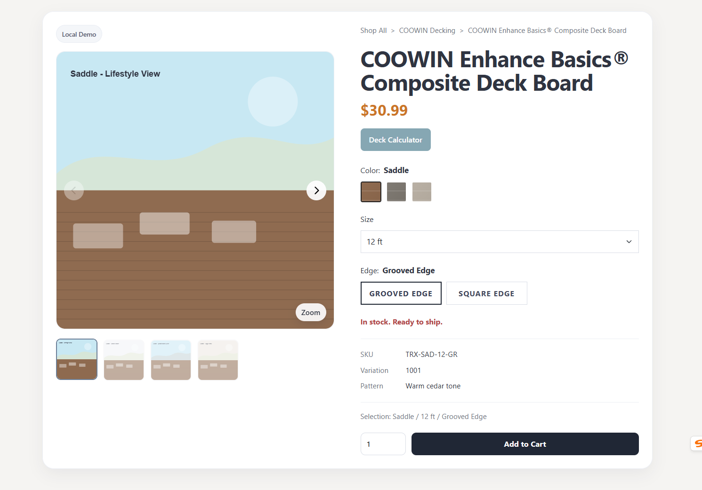

# Configurable Product Detail Page Demo

A configurable front-end product detail page demo with two modes:

- **Lite** — simple, dependency-light, and easy to preview locally
- **Pro** — richer gallery experience powered by **Swiper** and **PhotoSwipe**

This project is designed for **static use first**, with a structure that stays easy to edit and can later be adapted for **WooCommerce**, **PHP templates**, or other CMS integrations.



---

## Features

- Two versions for different use cases:
  - **Lite**: native JavaScript, simple local preview, minimal dependency overhead
  - **Pro**: enhanced gallery, thumbnails, arrows, zoom, richer UI interaction
- Product data is separated from rendering logic for easier editing
- Defensive front-end structure:
  - optional HTML blocks can be removed without breaking the page
  - suitable for static product pages, showcase pages, or future commerce integration
- Easy to customize:
  - title, price, gallery, attributes, metadata, and variants
  - colors, sizes, edge types, image groups, and stock states
- Clean front-end structure based on:
  - HTML
  - CSS
  - JavaScript
  - Bootstrap layout utilities
- Pro mode supports:
  - Swiper gallery
  - PhotoSwipe zoom/lightbox

---

## Demo Modes

| Version | Best for | Gallery | Zoom | Preview |
|--------|----------|---------|------|---------|
| Lite | quick editing, static preview, simple showcase pages | native JS | simple zoom | open HTML directly |
| Pro | richer product gallery experience, more polished demos | Swiper | PhotoSwipe | local server recommended |

---

## Project Structure

```text
.
├─ index.html
├─ lite/
│  ├─ index.html
│  ├─ css/
│  ├─ js/
│  └─ images/
├─ pro/
│  ├─ index.html
│  ├─ css/
│  ├─ js/
│  └─ images/
└─ docs/
   └─ preview.png
```

---

## Quick Start

### Lite

The Lite version is intended to be very easy to preview.

Open:

```text
lite/index.html
```

In many cases, this can be opened directly in the browser.

---

### Pro

The Pro version is better suited for a local server environment.

Open a terminal in the `pro/` directory and run:

```bash
python -m http.server 5500
```

Then visit:

```text
http://localhost:5500
```

---

## Editing Product Content

The product content is stored in:

```text
lite/js/product-data.js
pro/js/product-data.js
```

Typical editable sections include:

- product title
- price
- breadcrumb text
- color swatches
- size options
- edge options
- image groups
- variant combinations
- stock / SKU / metadata

This keeps content changes separate from the rendering logic.

---

## Customization

### 1. Change layout or remove sections

You can safely remove optional HTML blocks such as:

- swatches
- thumbnails
- metadata rows
- helper sections
- action buttons

The JavaScript is written defensively so missing elements are skipped instead of throwing runtime errors.

### 2. Change styles

Edit:

```text
lite/css/product-details.css
pro/css/product-details.css
```

This is where you can adjust:

- spacing
- typography
- colors
- gallery controls
- thumbnail styling
- responsive layout
- button appearance

### 3. Change product data

Edit:

```text
lite/js/product-data.js
pro/js/product-data.js
```

This is the main place for changing page content without touching the page logic.

---

## Why This Project

This project was built around a practical front-end workflow:

- start with a clean static product page
- keep it easy to preview locally
- make it easy to edit without a build step
- keep the structure flexible enough for future CMS or WooCommerce integration

It is useful for:

- product showcase pages
- static product landing pages
- UI demos
- front-end prototyping
- future e-commerce detail page integration

---

## WooCommerce / PHP Adaptation

This repository is not tied to WooCommerce by default.

However, the structure is intentionally compatible with future adaptation. A common next step would be:

- output product data from PHP
- assign it to a global variable such as `window.PRODUCT_DATA`
- reuse the existing front-end rendering logic

That makes this project suitable as a front-end starting point before commerce integration is added.

---

## Recommended GitHub Topics

```text
product-page
product-detail
frontend
javascript
static-site
bootstrap
swiper
photoswipe
ecommerce-ui
configurable-ui
```

---

## Roadmap

- shared asset structure for Lite and Pro
- JSON-based product source option
- optional inquiry-only mode
- optional WooCommerce adapter layer
- cleaner shared component pattern between Lite and Pro
- more reusable gallery controls

---

## License

This project is licensed under the MIT License.
